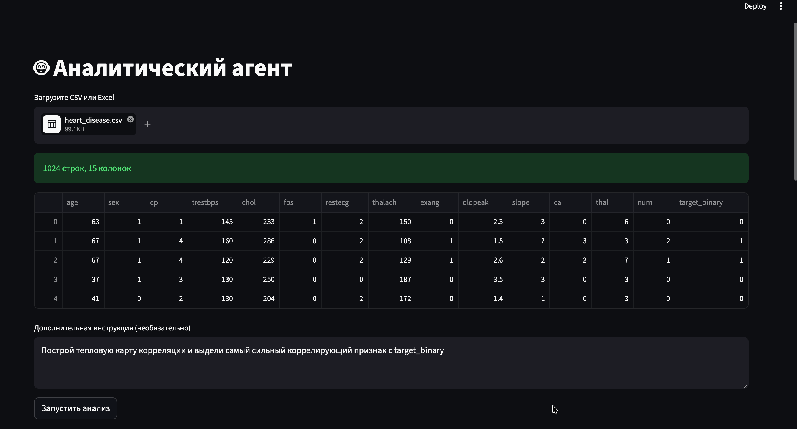
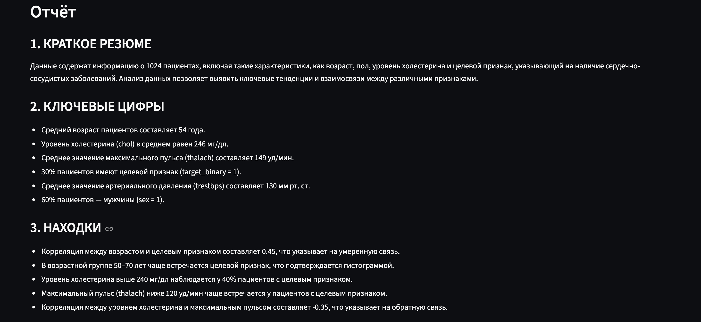
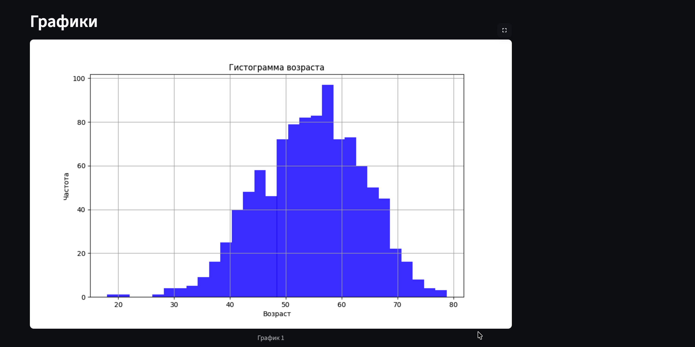

# Задание 3 – Мини‑продукт с LLM‑аналитикой

## Описание

Веб‑приложение на **Streamlit**, в которое пользователь загружает CSV‑файл. **LLM‑агент** (gpt‑4o‑mini через GitHub Models) самостоятельно анализирует данные: получает общую информацию, строит графики (гистограмму, тепловую карту корреляций, scatter plot), вычисляет ключевые метрики и выдаёт структурированный аналитический отчёт на русском языке.

LLM **сама пишет и выполняет Python‑код** через механизм tool‑calling.


## Инструкция запуска

### 1. Установка зависимостей

```bash
pip install -r requirements.txt
```

### 2. Настройка API-ключа

Получите бесплатный API-ключ через GitHub Models:

1. Перейдите в настройки GitHub → Developer settings → Personal access tokens → Fine-grained tokens.

2. Создайте токен с разрешением Read-only для Models.

3. Скопируйте токен.

```bash
cp .env.example .env
# Отредактируйте .env и вставьте ваш GITHUB_TOKEN
```
### 3. Запуск

```bash
streamlit run app.py
```
---

## Скриншоты работы

1. Загрузка файла и предпросмотр данных  
   
2. Финальный отчёт  
   
3. Построенные графики  
   

---
